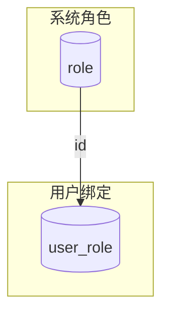

# 角色模型设计说明

## 目标
- 只保留 **role** 这一层，所有鉴权都基于“用户是否具备某个角色”。
- 按 `systemCode` 隔离，每个业务系统可有自己的管理员角色；超级管理员跨系统生效。
- 支持角色的增删改查，以及将角色分配给用户（管理员或自助场景）。

## 核心数据
- `role`：包含 `code`、`name`、`description`、`system_code`。约定 `SUPER_ADMIN` 为全局超级管理员，`SYSTEM_ADMIN` 作为各业务系统的系统管理员角色代码。
- `user_role`：以 `user_id + system_code` 为唯一键，为用户维护逗号分隔的角色 ID 列表。

## 关键能力
1. **角色 CRUD**：
   - 创建/更新/删除角色仅允许超级管理员或对应 `systemCode` 的系统管理员。
   - 角色编码全局唯一，同一系统可维护多种业务角色。
2. **用户授予角色**：
   - 超级管理员可操作所有系统用户。
   - 系统管理员仅能调整自身 `systemCode` 下的角色。
   - 用户可自助给自己绑定角色（用于充值会员等无需管理员审批的场景）；跨用户操作需要管理员。
   - 以 `systemCode` 为维度存储并缓存用户的角色集合（Redis key：`user_roles_{userId}_{systemCode}`）。
3. **查询**：
   - `hasRole` / `getUserRoles` 直接基于角色集合判定。

## API/控制器
- `/roles`：角色 CRUD。
- `/roles/user`：为用户设置角色（覆盖）。
- `/roles/user/{userId}`：查询指定系统的用户角色列表（需带 `systemCode`）。

## 使用示例
1. **创建角色**：`POST /roles`，`operatorId` 需为超级管理员或系统管理员。
2. **用户自助开通会员**：业务服务在完成支付后调用 `POST /roles/user`，令 `operatorId == userId` 即可无需管理员身份。
3. **管理员分配角色**：系统管理员批量给用户授予当前系统的角色 ID 集合。

## 注意事项
- 管理员角色通过角色编码约定实现，无需额外表；系统管理员判定依赖 `SYSTEM_ADMIN` 角色在对应 `systemCode` 下是否存在且被授予目标用户。
- 删除角色不会自动清理 `user_role` 中的已删除 ID，后续可通过批处理或 SQL 批量修复。
- 用户-角色的存储形态为单行多角色 ID 字符串，便于批量操作和缓存。
